## Preamble

This tutorial was inspired by a Lunch and Learn that I gave a few years ago. The 
state machine implementation for that presentation was in C (although,
given the audience, it should have been in C++). For this article, it's in 
[Julia](https://github.com/AndrewWasHere/HSM.jl). 
I've also implemented state machine libraries in 
[C++](https://github.com/AndrewWasHere/statemachine-arduino) 
and Python.

State charts for this tutorial were created with 
[PlantUML](https://plantuml.com).
Whenever possible, I include the source code with the rendered diagram.

At the time of writing, I am early into my dive into Julia, so some of my
implementation choices may not be the most julian way of doing things.

## What is a State Machine

A state machine is a representation of a system that can react differently to
the same input depending on its current state. That input is usually called an
event. An event triggers an action in the state machine, and, possibly, a change 
of state. That is to say, a state machine is a representation of an 
event-driven, stateful system.

The graphical representation of the state machine is a state chart. In the state 
chart, states are represented by boxes. State transitions are represented by 
arrows between boxes. Events are represented by text in the boxes or next to the 
arrows. Actions are represented by text following the event text. Events 
and actions are separated by a '/'. This will make more sense with an example.

Think of a locking 
[turnstile](https://en.wikipedia.org/wiki/Turnstile). 
The gate will not turn and let a person through until a token is inserted into 
the turnstile. Once a token has been inserted, and a person has passed through, 
the gate locks again.

A turnstile state machine has two states -- a locked state, and an unlocked 
state. If someone tries to turn the turnstile (an event) when it is locked (a 
state), it will not turn. When the turnstile is unlocked (a state), if someone 
tries to turn it, the turnstile will turn. When the turn is complete (an event),
the turnstile will lock (an action) and return to the locked state (a state 
transition). If a token is inserted into the turnstile (an event) when it is 
locked (a state), the turnstile will unlock (an action and a state transition).

A state machine describing the turnstile can look like this:

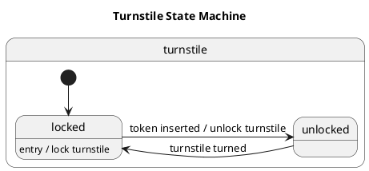


There are some differences between my written description and the state chart.
First, there is a black dot (`[*]` in the PlantUML) with an arrow connecting it
to the locked state. That is an _initialization_ event. When the turnstile state
machine is first started (initialized), it transitions to the locked state.

Second, the _lock turnstile_ action when transitioning to the locked state
has been associated with an _entry_ event to the locked state. That's because
the _lock turnstile_ action needs to happen whenever the locked state is
entered. That happens both during initialization and when transitioning from
the unlocked state, so we might as well combine them to avoid boilerplate.

If you play with the state machine by tracing states with your finger, and
talking your way through event handling, you will find that it's a very compact,
descriptive way of designing and communicating event-driven systems.

For our turnstile state machine, start at the black dot. This is the
initialization of the turnstile state machine, so we immediately follow the
arrow attaching it to the locked state -- turnstiles start locked.

From the initializer, we entered the locked state -- an _entry_ event happened, 
and the turnstile got locked as an action.

If someone tries to turn the turnstile while it is in the locked state, it won't
turn. The _turnstile turned_ event cannot happen, so the state machine ignores
that event in the locked state.

The only event that the locked state cares about is if someone inserts a token
-- a _token inserted_ event occurs. Then the turnstile state machine will
_unlock the turnstile_ and follow the arrow to the unlocked state. There is no
_entry_ event associated with the unlocked state, so no additional actions
happen.

In the unlocked state, if a _token inserted_ event occurs, it is ignored.

The only event the unlocked state cares about is if someone turns the turnstile.
When that happens, the turnstile state machine transitions to the locked state
without any other actions. There is an _entry_ event associated with the
locked state which locks the turnstile, so that action happens when the
locked state is entered.

### The Defining Features of a State Machine

Now that you've played with a state machine, we need to call out some key
features that new state machine designers often get tripped up on.

States do not do anything. States determine how events are processed. If there 
are no events, nothing happens. There are no actions when sitting in a 
state. Actions only happen in response to events. These events and actions
are enumerated in the state machine as _event_ / _action_ labels on the 
states and state transitions.

Actions can generate events, but these events should not be processed
immediately. Instead, the event should be added to the event queue that feeds
the state machine. That way, events that happened before the generated event
will be processed before the generated event. That is to say, events are
processed in order of arrival.

State initialization, entry, and exit are special cases. They are processed as
part of state transitions, and are not events that get placed on the event
queue. We will differentiate between these special cases and user-defined events
by referring to state initialization, entry and exit as "state events", and
user-defined events as just "events".

## Sidebar: What is not a State Machine

Activity diagrams -- also known as flow charts -- are not state machines.

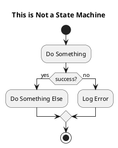


Here's why:

Unlike a state chart, in activity diagrams, the boxes do something. They are 
actions. The arrows between boxes separate individual actions, and are not
conditionally traversed, as in a state chart. Conditionals in an activity
diagram are represented by angled boxes. 

In the above diagram, the first box does something, then the result of that 
something is checked in the angled box below it, and so on. It is an algorithm. 
Which is what activity diagrams are meant to represent.

Many a software developer has confused activity diagrams for state machines.
Don't be one of them.

Many a software developer has used activity diagrams -- perhaps subconsciously 
-- to implement state machines. This generally results in states being stored as 
enumerated values, and big `switch` or `case` blocks or `if ... else if` chains 
scattered throughout the code to handle all the different state and event 
combinations. This quickly results in 
[big balls of mud](https://en.wikipedia.org/wiki/Big_ball_of_mud) 
and unmaintainable 
[spaghetti code](https://en.wikipedia.org/wiki/Spaghetti_code).
Don't be one of them, either.

## Hierarchical State Machines

[Hierarchical state machines](https://en.wikipedia.org/wiki/UML_state_machine) 
come from the 
[Unified Modeling Language (UML)](https://en.wikipedia.org/wiki/Unified_Modeling_Language).
Their defining feature is that states can contain sub-states. The upshot of this
is that common event handling for a group of states can be handled by the parent
state, reducing boilerplate. A state with sub-states can also "remember" its 
last active state so that state can be activated if the parent state is 
transitioned to. This is called transitioning to history.

### Example Hierarchical State Machine

An example of an hierarchical state machine is a model of a digital thermometer
that can toggle between displaying temperature in Celsius or Fahrenheit when on.
The thermometer remembers which units it was displaying while off, so if it was
displaying degrees Celsius, when turned on again, it will again display degrees
Celsius. If it was displaying degrees Fahrenheit, when turned on again, it will
display temperature in Fahrenheit.

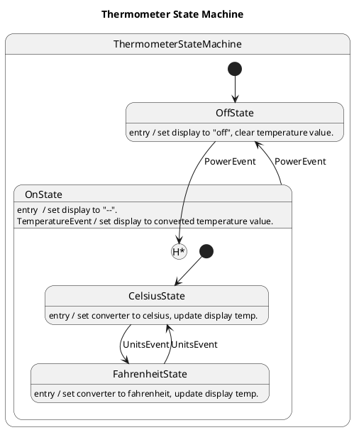


When the thermometer state machine initially starts, it enters OffState. In 
OffState, the thermometer state machine only acts on a PowerEvent. All other 
events are ignored. On a PowerEvent, the thermometer state machine transitions 
to OnState.

On initial entry, OnState transitions to the CelsiusState. Whenever the
CelsiusState is entered, the converter is set to Celsius. 

OnState handles TemperatureEvents for all its sub-states. When a TemperatureEvent 
is processed, the active converter is called to convert the temperature to the 
active units, and that value is displayed.

When a UnitsEvent is processed, the thermometer state machine toggles between
Celsius and Fahrenheit by transitioning between the two OnState sub-states.

### With Hierarchy Comes Complexity

With states embedded in states, transitions can become tricky. Transitioning
from a sub-state to another state can mean not only exiting the previously active
state, but its parent state (and, potentially, its parent state's parent state,
etc.) as well. Entering a state can mean not only entering that state, but its 
parent (and, potentially, it's parent's parent, etc). Care must be taken to 
track the hierarchy of state affected by state transitions.

## State Machine Implementation

For any state machine implementation, it is desirable to hide the details of the
internal workings of the machine. As a user of the library, the developer should
not have to keep track of the current active state of the state machine, nor its
hierarchy, once the states and their event handling have been defined. The 
developer should be able to pass events to the state machine, and let the 
machine sort it out. Like this:

```julia
for event in event_queue
  handle_event!(state_machine, event)
end
```

So how do we get there? Let's look at our Thermometer State Machine again.

There are two types of objects that need to be identified abstractly -- Events
and States. In an object-oriented language, we could use a base class for each,
and define user events and state machine states in terms of the base classes.
Although Julia is not an object-oriented language, it has a similar feature in
abstract types. Abstract types are used to declare sets of related concrete 
types. Abstract types do not define common values for the related types, as you 
can do with base classes, so it is incumbent on the library to define common
parameters, their getter and setter functions, and for the developer to include 
common parameters in the derived types, and extend the getter and setter
functions, if necessary.

Of the two, Events are simpler than States, so let's look at them first.

### Events

If we play fast and loose with UML class diagrams, we want to build this
relationship:

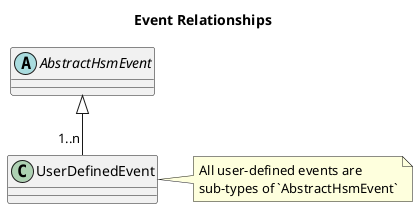


All user-defined events are `AbstractHsmEvent`s. As mentioned previously,
`AbstractHsmEvent` cannot declare any inherited contents. But that's okay.
Events don't need to share any data.

This gives us the type definition for the second argument to `handle_event!()`:

```julia
function handle_event!(state_machine, event::AbstractHsmEvent)
```

`handle_event!()` will be responsible for finding the active state in
`state_machine` and calling the event handler for that state with `event` as
an argument.

For the thermometer state machine, there are three user-defined events --
PowerEvent, UnitsEvent, and TemperatureEvent.

```julia
struct PowerEvent <: HSM.AbstractHsmEvent
end

struct UnitsEvent <: HSM.AbstractHsmEvent
end

struct TemperatureEvent <:HSM.AbstractHsmEvent
    temperature::Float64
end
```

TemperatureEvent carries some data with it. PowerEvent and UnitsEvent are
virtual button presses.

Events are instantiated as they happen, and are fed to the state machine via
`handle_event!()`

### States

Similar to events, we want all user-defined states to be `AbstractHsmState`s. 
However, there is some common information that each state needs to store. 
Specifically, a state's parent state, and active sub-state. Our state machine 
library will provide getter and setter functions for these values, and the 
implemented state machine will have to implement these functions for each state. 
That feels like a lot of boilerplate to me, so the library will provide a 
default method of storing a state's parent state and active sub-state.  If the 
implementer wants to use them, they just have to add the provided data structure 
to their concrete state implementation.

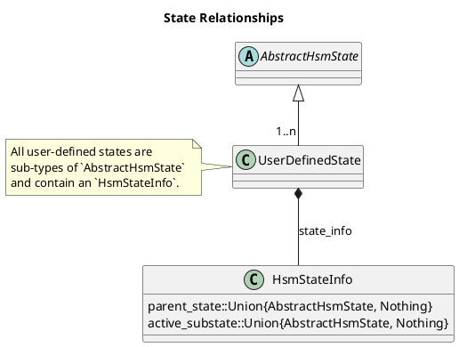


User-defined states will have an element called `state_info` that is an
`HsmStateInfo` structure. The burden is on the developer to add this structure 
to all concrete states, and initialize it as part of the concrete state's 
constructor. Since only the `parent_state` value has a user-defined value --
`active_substate` always gets initialized to `nothing` -- the burden is low.

`parent_state` is the state that contains the user-defined state. It is used
to traverse up the state "stack" during state transitions, so the exit and entry
actions can be called for the necessary states.

`active_substate` can be followed from the root state machine state to find the
current state of the state machine. It can also be used to do transitions to
history.

With that, we can define the types for our state machine event handler.

```julia
function handle_event!(state_machine::AbstractHsmState, event::AbstractHsmEvent)
```

For our thermometer state machine, we define five concrete states:
ThermometerStateMachine, OffState, OnState, CelsiusState, and FahrenheitState.

```julia
struct ThermometerStateMachine <: AbstractHsmState
  state_info::HSMStateInfo
  thermometer::Thermometer

  ThermometerStateMachine(parent, thermometer) = new(HsmStateInfo(parent), thermometer)
end

struct OffState <: AbstractHsmState
  # Looks exactly like ThermometerStateMachine, except for the constructor name.
end

struct OnState <: AbstractHsmState
  # Looks exactly like ThermometerStateMachine, except for the constructor name.
end

struct CelsiusState <: AbstractHsmState
  # Looks exactly like ThermometerStateMachine, except for the constructor name.
end

struct FahrenheitState <: AbstractHsmState
  # Looks exactly like ThermometerStateMachine, except for the constructor name.
end
```

where `thermometer` is a data structure containing the things that state machine
actions operate on.

The parent state of ThermometerStateMachine is `nothing`. There is no box
encompassing it in the state chart.

The parent state of OffState is ThermometerStateMachine. It resides inside
ThermometerStateMachine in the state chart.

The parent state of OnState is ThermometerStateMachine. It, too, resides
inside ThermometerStateMachine in the state chart.

The parent state of CelsiusState is OnState. It resides in OnState in the
state chart.

The parent state of FahrenheitState is OnState. It also resides in OnState
in the state chart.

The code to instantiate instances of this state machine looks like this:

```julia
thermometer = Thermometer()

thermometer_state_machine = ThermometerStateMachine(nothing, thermometer)
off_state = OffState(thermometer_state_machine, thermometer)
on_state = OnState(thermometer_state_machine, thermometer)
celsius_state = CelsiusState(on_state, thermometer)
fahrenheit_state = FahrenheitState(on_state, thermometer)
```

Other than defining abstract events and states, the state machine library must 
provide provide default handlers for state initialization, entry, and exit that 
can be extended for concrete states. It must also provide an interface to do
state transitions, and transitions to state history. Finally, the library must 
provide event handlers for AbstractHsmState and AbstractHsmEvent that the 
user can extend to handle events in their concrete states.

### State Events

State events enact actions that occur when entering or leaving a state 
irrespective of the source state, for entering state events, or destination
state for exiting state events. The state events are state initialization, state 
entry, and state exit. State events are not required for a state. An absent
state event indicates that nothing extra happens on state entry or exit. 

Oftentimes the same actions occur on all transitions into and / or out of a 
state. In these cases, the actions can be combined inside a state event 
processor instead of individual event handlers to reduce boilerplate.

#### State Initialization

State initialization is represented in a state chart by a black dot with an
arrow to a substate (a '[*]' with an arrow to a state in PlantUML). This 
substate is the starting state when the parent state is entered without history, 
or for the first time. States which do not have substates, which will be most 
states in a state machine, do not need to be initialized, so the default 
initialization function should not do anything.

```julia
function on_initialize!(state::AbstractHsmState)
    # Do nothing.
end
```

In the thermometer state machine, two states initialize themselves --
ThermometerStateMachine, and OnState. State initialization is circled in the
state chart (commented directly above in the PlantUML).

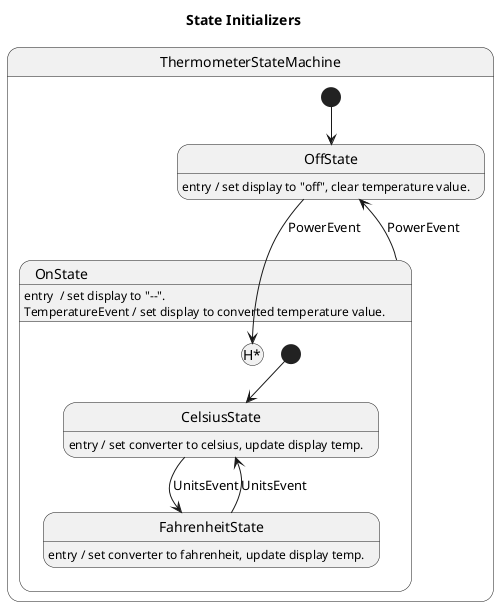


ThermometerStateMachine transitions to OffState in its initializer.

```julia
function HSM.on_initialize!(state::ThermometerStateMachine)
    HSM.transition_to_state!(thermometer_state_machine, off_state)
end
```

OnState transitions to CelsiusState in its initializer.

```julia
function HSM.on_initialize!(state::OnState)
    HSM.transition_to_state!(thermometer_state_machine, celsius_state)
end
```

Every state initialization in the state chart has a corresponding 
`on_initialize!()` implementation in the code whose arguments are the state
type that is being initialized. If the state machine was modified to modify
initializers, it is obvious where in the code changes need to be made to match
the modifications.

#### State Entry

State entry is represented in a state chart by an event labeled "entry" in the
state separated by a "/" from the actions taken due to state entry.

In the thermometer state machine, all states except ThermometerStateMachine have
state entry actions. They are circled in the state chart (commented directly
above in the PlantUML).)

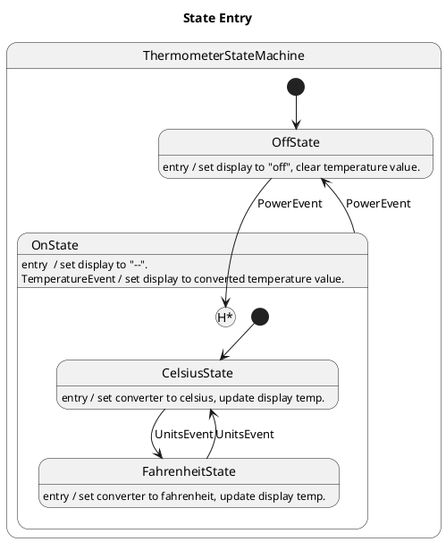


OffState sets the display to "off" and clears the stored temperature value.

```julia
function HSM.on_entry!(state::OffState)
    state.thermometer.display = "off"
    state.thermometer.temperature = nothing
end
```

OnState sets the display to "--".

```julia
function HSM.on_entry!(state::OnState)
    state.thermometer.display = "--"
end
```

CelsiusState sets the temperature converter function to `celsius()`. If there is 
a current temperature being displayed, that temperature is converted to Celsius.

```julia
function HSM.on_entry!(state::CelsiusState)
    state.thermometer.convert = celsius
    if !isnothing(state.thermometer.temperature)
        state.thermometer.display = state.thermometer.convert(state.thermometer.temperature)
    end
end
```

FahrenheitState sets the temperature converter function to `fahrenheit()`. If 
there is a current temperature being displayed, that temperature is converted
to Fahrenheit.

```julia
function HSM.on_entry!(state::FahrenheitState)
    state.thermometer.convert = fahrenheit
    if !isnothing(state.thermometer.temperature)
        state.thermometer.display = state.thermometer.convert(state.thermometer.temperature)
    end
end
```

Every state with an entry event handler has an `on_entry!()` function extension.
There is a direct mapping from state entry on the state chart to their
implementation in the code.

#### State Exit

State exit is represented in a state chart by an event labeled "exit" in the
state separated by a "/" from the side effects caused by state exit. In the 
thermometer state machine, no states have state exit handlers. In the state exit
example state machine, the state exit is circled (commented directly above in
the PlantUML).

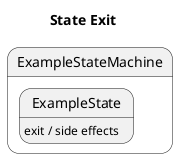


In the thermometer state machine, no states have state exit handlers.
Implementation of state exit handlers is similar to state entry. In general,
every state with a state exit in the state chart has an `on_exit!()` function 
extension. Declare an `on_exit!()` function for the concrete state, and have it 
implement the actions listed in the state chart.

```julia
function HSM.on_exit!(state::ExampleState)
  # Do actions.
end
```

### State Transitions

State transitions are actions that change the active state in a state machine. 
In an hierarchical state machine, the transition has to be cognizant of which 
parent states are exited and which substates are entered as part of the state 
transition. For each state exited as part of the state transition, that state's 
exit action has to be called. Similarly, for each state entered as part of the 
state transition, that state's entry action must be called. See 
[State Actions](#state-actions) for more information.

Hierarchical state machine states also retain memory of which of its substates
was last active. Because of this, state transitions can transition to that last
active state. This is called transition to history. There are two ways of 
transitioning to history. Transition to shallow history returns to the last 
active substate of a state, and transition to deep history returns to the
deepest active substate of a state.

#### Transition to State

State transitions are represented by arrows connecting one state to another on
a state chart. They are labeled with an event and possibly, actions. The event
and actions are separated by a '/'. In our thermometer state machine, there are 
state transitions from OnState to OffState (triggered by a PowerEvent), 
CelsiusState to FahrenheitState (triggered by a UnitsEvent), and FahrenheitState 
to CelsiusState (triggered by a UnitsEvent).  There happen to be no other 
actions caused by the handling of these events. The state transition arrows are
circled on the state chart (commented directly above in the PlantUML).

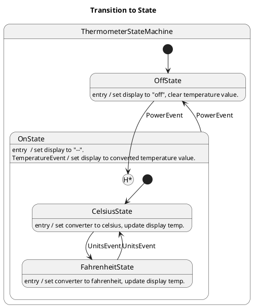


The transition from OffState to OnState is not a state transition. It is a
[transition to deep history](#transition-to-deep-history).

To execute a state transition, we must first find the common parent of the
active state and the destination state. 

```julia
function transition_to_state!(state_machine::AbstractHsmState, state::AbstractHsmState)
    s = active_state(state_machine)
    cp = common_parent(s, state)
```

We then call `on_exit!()` for every state from the active state up to, but not 
including, the common parent. 

```julia
    while s != cp
        on_exit!(s)
        s = parent_state(s)
    end
```

Next, we have to update the `active_substate` values from the parent of the new
active state to the common parent to guide us to the new active state.

```julia
    active_substate!(state, nothing)
    s = state
    while s != cp
        active_substate!(parent_state(s), s)
        s = parent_state(s)
    end
```

Then we call `on_entry!()` for all states under the common parent that lead to
the new active state.

```julia
    s = active_substate(cp)
    while !isnothing(s)
        on_entry!(s)
        s = active_substate(s)
    end
```

Finally, we call `on_initialize()` for the new active state.

```julia
    on_initialize!(state)
end
```

For the thermometer state machine, a transition from CelsiusState to 
FahrenheitState, as initiated by a UnitsEvent, would find the common parent of
CelsiusState and FahrenheitState -- OnState. 

It would then call `on_exit!()` for CelsiusState. CelsiusState does not have an
`on_exit!()` defined, so the default `on_exit!(state::AbstractHsmState)` is
called, which does nothing.

Next, `active_substate` would be updated for all states from the state being
transitioned to and the common parent -- FahrenheitState (set to `nothing`) and
OnState (set to FahrenheitState).

Then `on_entry!()` is called for FahrenheitState, which sets the thermometer
temperature converter function to `fahrenheit()`.

Finally, `on_initialize()!` is called for FahrenheitState. FahrenheitState does
not have an `on_initialize!()` defined, so the default 
`on_initialize!(state::AbstractHsmState)` is called, which does nothing.

For a more complicated example, consider a transition from OnState to OffState
due to a PowerEvent. In this case, the common parent is ThermometerStateMachine.
However the active state is a substate of OnState, say FahrenheitState, in this
case.

`on_exit!()` is called for FahrenheitState and OnState.

`active_substate` is updated for OffState (set to `nothing`) and 
ThermometerStateMachine (set to OffState).

`on_entry!()` is called for OffState.

`on_initialize!()` is called for OffState.

#### Transition to Shallow History

Transitions to shallow history are represented by arrows connecting one state
to a circled 'H' in another (`[H]` appended to the state name in PlantUML). This 
indicates that instead of transitioning to the state containing the circled 'H', 
the transition is actually to the last active substate in the state containing 
the circled 'H'.

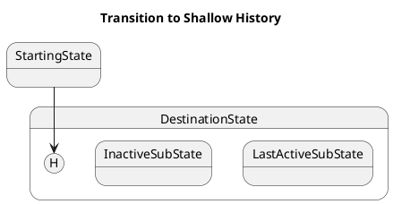


In the above diagram, a transition to shallow history from StartingState to
DestinationState will actually transition to LastActiveSubState, assuming, as
its name suggests, that LastActiveSubState was the last active substate under
DestinationState before the transition to shallow history.

In the thermometer state machine example, OffState does a transition to deep
history of OnState, but since OnState only has one level of substates, the
transition is effectively the same as a transition to shallow history.

#### Transition to Deep History

Transitions to deep history are represented by arrows connecting one state to a
circled 'H\*' in another (`[H*]` appended to the state name in PlantUML). This 
indicates that instead of transitioning to the state containing the circled 
'H\*', the transition is actually to the last active deepest substate in the 
state containing the circled 'H\*'.

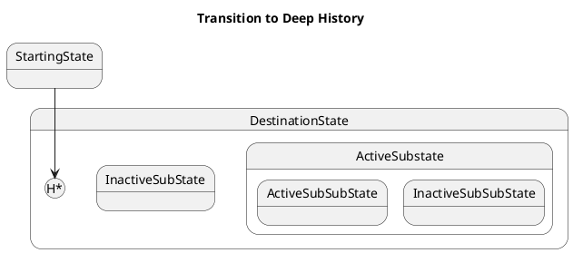


In the above diagram, a transition to deep history from StartingState to
DestinationState will actually transition to ActiveSubSubState, assuming, as its
name suggests, that ActiveSubSubState was the last active sub-substate under
DestinationState before the transition to deep history.

In the thermometer state machine example, OffState does a transition to deep
history of OnState, but since OnState only has one level of substates, the
transition is effectively the same as a transition to shallow history, so the
above is a better example of transitions to deep history.

### Event Handling

User-defined event handling is done by feeding the event to the state machine
via the 
`handle_event!(state_machine::AbstractHsmState, event::AbstractHsmEvent)`
interface.

`handle_event!()` finds the active state of the state machine, and passes the
event to the `on_event!()` event handler for that state. if that state does not
process the event, or it wants its parent state to continue processing the
event, `handle_event!()` calls the parent's event handler. This continues until
the event is reported handled, or `handle_event!()` runs out of states.

```julia
function handle_event!(state_machine::AbstractHsmState, event::AbstractHsmEvent)
    handled = false

    s = active_state(state_machine)
    while !isnothing(s) && !(handled = on_event!(s, event))
        s = parent_state(s)
    end

    if !handled 
        throw(
            HsmUnhandledEventError("Unhandled Event: $(string(typeof(event)))")
        )
    end
end
```

It is the responsibility of the state machine implementation to extend the
`on_event!()` event handler for states that process concrete events.

#### On Event

The base event handler is `on_event!()`.

```julia
on_event!(state::AbstractHsmState, event::AbstractHsmEvent)
```

It is the default handler for all user-defined events. `on_event!()` is extended 
for each concrete state and event which that state handles. In the state 
diagram, each extension is represented by an event / side effect pair -- or just 
an event, if there is no side effect -- as circled below (labeled with a comment
directly above the event handler in the PlantUML):


In a state machine implementation, there should be one `on_event!()` extension
for every state / event pair. For our thermometer state machine, we would extend
`on_event!()` thus:

`OffState` only handles `PowerEvent`s, so `on_event!()` is extended with
`OffState` and `PowerEvent` arguments. The state chart shows that a PowerEvent
handled by OffState results in a transition to deep history to OnState. That is
what the implementation of the event handler shows.

```julia
function HSM.on_event!(state::OffState, event::PowerEvent)
    HSM.transition_to_deep_history!(thermometer_state_machine, on_state)
    return true
end
```

`OnState` handles `PowerEvent`s and `TemperatureEvents`, so `on_event!()` is
extended with `OnState` and `PowerEvent` arguments as well as `OnState` and
`TemperatureEvent` arguments.

The state chart shows that a PowerEvent in OnState results in a state transition
to OffState, so that is all the event handler does.

```julia
function HSM.on_event!(state::OnState, event::PowerEvent)
    HSM.transition_to_state!(thermometer_state_machine, off_state)
    return true
end

TemperatureEvents change the active temperature converter function, and updates
the temperature display. There is no state change associated with 
TemperatureEvents. That is what the event handler does.

function HSM.on_event!(state::OnState, event::TemperatureEvent)
    state.thermometer.display = state.thermometer.convert(event.temperature)
    state.thermometer.temperature = event.temperature
    return true
end
```

`CelsiusState` only handles `UnitEvent`s, so `on_event!()` is extended with
`ClesiusState` and `UnitEvent` arguments.

The state chart show that UnitsEvents just change state. So CelsiusState will 
transition to FahrenheitState.

```julia
function HSM.on_event!(state::CelsiusState, event::UnitsEvent)
    HSM.transition_to_state!(thermometer_state_machine, fahrenheit_state)
    return true
end
```

`FahrenheitState` only handles `UnitEvent`s as well, so `on_event!()` is
extended with `FahrenheitState` and `UnitEvent` arguments, and just transitions
to CelsiusState, just as the state chart show.

```julia
function HSM.on_event!(state::FahrenheitState, event::UnitsEvent)
    HSM.transition_to_state!(thermometer_state_machine, kelvin_state)
    return true
end
```

All the above extensions return `true` when complete because the state's parent 
state is not expected to process the event as well.

Every state-event pair on the state machine diagram has a corresponding 
`on_event!()` in the code. This makes the state machine easy to maintain and
modify if the machine needs to be changed, because you know exactly which
functions need to be changed in the code.

There is one set of `on_event!()` extensions we have not mentioned yet.
ThermometerStateMachine handles all user events.

```julia
function HSM.on_event!(state::ThermometerStateMachine, event::PowerEvent)
    return true
end

function HSM.on_event!(state::ThermometerStateMachine, event::UnitsEvent)
    return true
end

function HSM.on_event!(state::ThermometerStateMachine, event::TemperatureEvent)
    return true
end
```

Why is this, if that isn't shown on the state chart? It is a guard against 
unknown events being processed by the state machine. ThermometerStateMachine 
returns `true` for all known user events. If the state machine handles an 
unknown event, the base `on_event!()` will handle the event, and return `false`, 
resulting in an `UnhandledEventError` being thrown, indicating that the event 
was not handled, instead of silently failing.

### Feeding the Machine

With the state machine states, events, and event handlers defined, all that
remains is to feed events to the state machine for processing. The best way to
do that is with an event queue. New events get added to the queue either
asynchronously or based on polling before the queue is processed by the state
machine.

A synchronous implementation would look something like this:

```julia
while running
    # Poll for events. Add any to `event_queue`.
    for event in event_queue
        handle_event!(state_machine, event)
    end
end
```

## Conclusion

In this tutorial we have described what an hierarchical state machine is, and
presented a library for implementing them in Julia. By using the description of 
a state machine to influence the design of the implementation, we demonstrated 
that it is possible to create clean, understandable, and maintainable state 
machine implementations with a one-to-one mapping from state chart to code.

If you would like to see complete source code for the implementation of the
thermometer state machine, see 
[test_thermometer.jl](https://github.com/AndrewWasHere/HSM.jl/blob/main/test/test_thermometer.jl) 
in 
[HSM.jl](https://github.com/AndrewWasHere/HSM.jl). 
It's got an extra units state (Kelvin), and takes advantage of Julia macros for 
the state constructors, but is otherwise equivalent to what was presented here.
There is also an interactive version of the thermometer state machine in Pluto
notebook form in 
[thermometer-notebook.jl](https://github.com/AndrewWasHere/HSM.jl/blob/main/example/thermometer-notebook.jl)
in HSM.jl. It gives you buttons and sliders to initiate events to the
thermometer state machine with, and outputs traces from the event processing.
